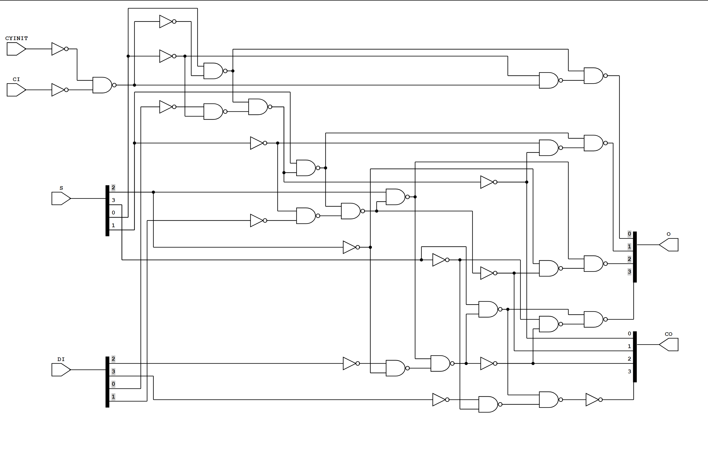

## Setup:

```console
$ ./build1.sh
$ source ./environment
$ ./build2.sh
```
## Generate NAND-optimized schematic.
```console
$ yosys -p 'synth -auto-top ; abc -g cmos2,-NOR; write_verilog output.v' carry4bits.v carry4whole.v -p 'write_json answer.json'
$ netlistsvg answer.json
```
## Here is the resulting out.svg:



